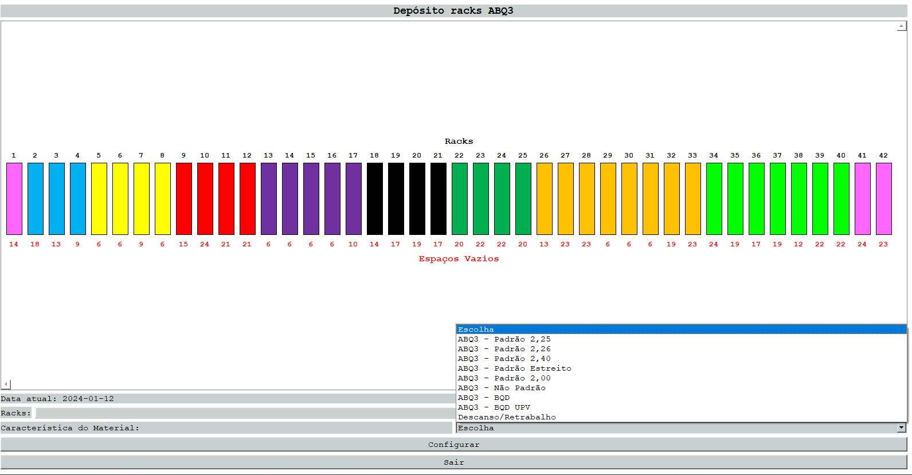

♥ Bem-Vindo ao meu Projeto 
# Configuração de estoque

Interface realizada em PyQt5 para configuração de racks separadas por cores e padrões específicos para alocações de bobinas. Otimiza o processo de alocação de bobinas na produção, melhorando a eficiência do PCP (Planejamento e Controle da Produção). Facilita a organização visual e intuitiva das bobinas em racks.

• 

• 
